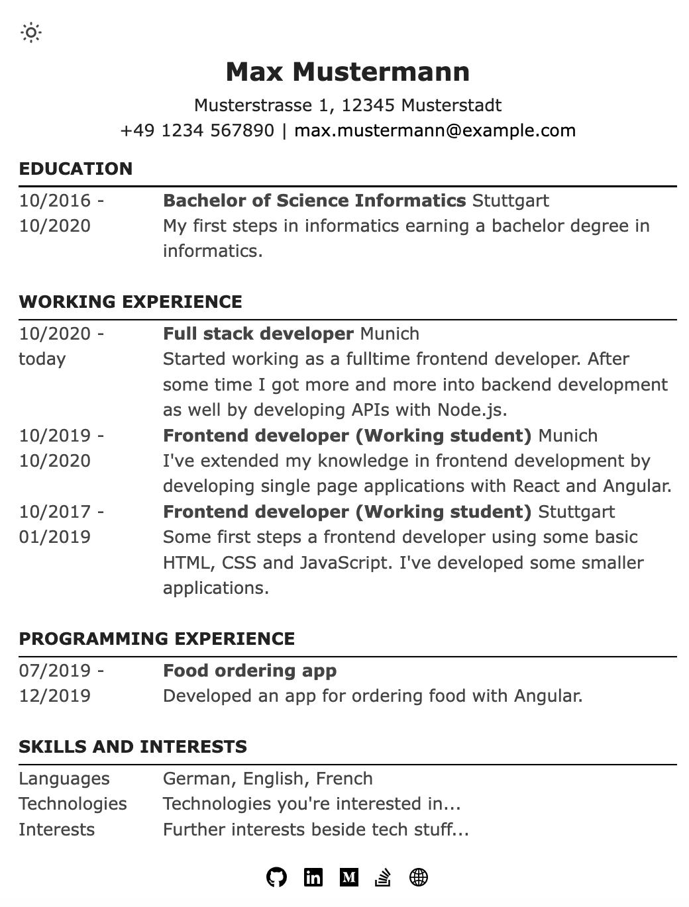
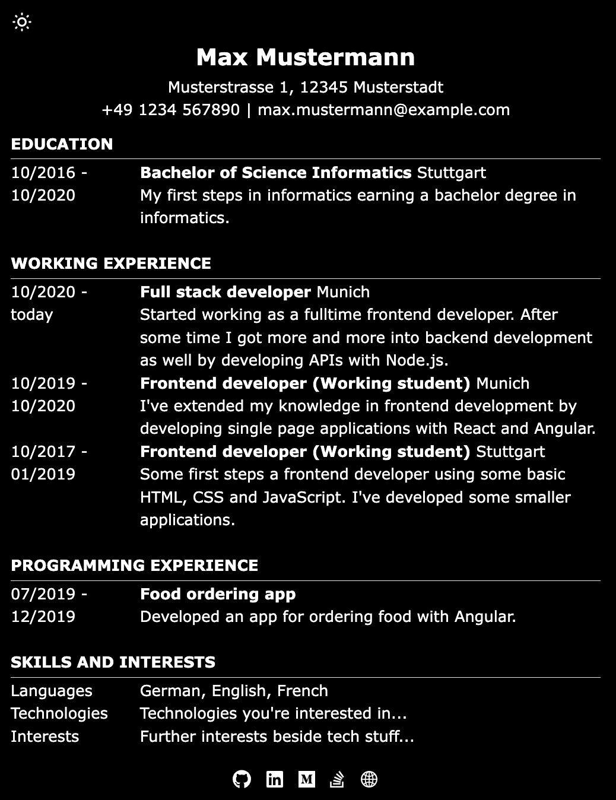

# Astro minimal CV

Template for a minimal CV with dark mode support. This CV is fully customizable and uses [`Tailwind`](https://tailwindcss.com). Furthermore, you can add your own social accounts using `astro-icon`.



```
## Source

Thx to https://github.com/alexanderhodes/astro-minimal-cv for the original template 👍

## Project structure

The project is structured in `components` and `pages`. Currently, only the index page is existing which contains all information about the CV.

In components, three main components are located. `RowEntry` is used for displaying a row in the table. `SectionTitle` provides the heading for a section containing one or more rows. And `SocialIcon` is used for displaying the social icons in the footer.
